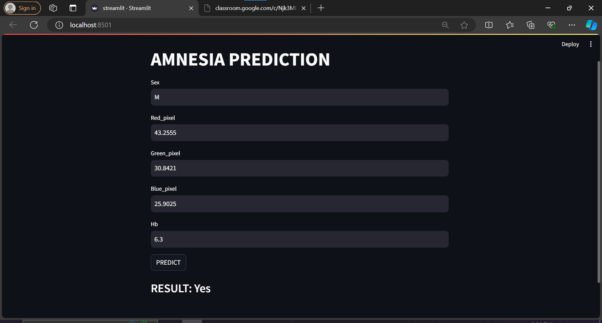

 # Mini Streamlit Project Based on Amnesia model

Welcome to the Mini Streamlit Amnesia Model Project! This project involves a pipeline creation, data visualization, and building a frontend using Streamlit.

## Introduction

This project is aimed at predicting amnesia (yes or no). The project workflow includes the following steps:

1. Using Kaggle's amnesia_data.csv.
2. EDA and Data Visualization.
3. Pipeline creation.
4. Model Application.
5. Creating a frontend using Streamlit for interactive user experience.

## Frontend with Streamlit

`streamlit.py` is file containing frontend code.Here, is a preview of frontend.

